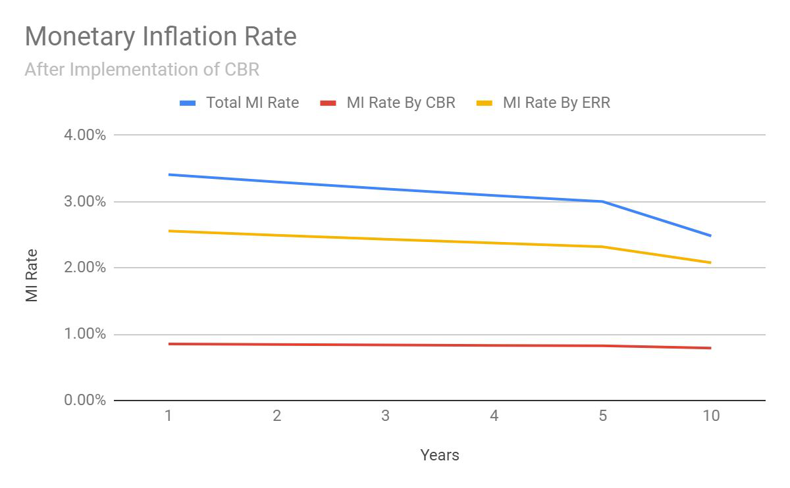

# Gridcoin Whitepaper

<!-- TOC -->

- [Gridcoin Whitepaper](#gridcoin-whitepaper)
  - [Introduction](#introduction)
    - [Gridcoin](#gridcoin)
    - [The Berkeley Open Infrastructure for Network Computing (BOINC)](#the-berkeley-open-infrastructure-for-network-computing-boinc)
    - [Computation Power](#computation-power)
    - [Results](#results)
  - [The Gridcoin Network and Protocol Overview](#the-gridcoin-network-and-protocol-overview)
  - [The Gridcoin Network](#the-gridcoin-network)
    - [Organization](#organization)
    - [Participants](#participants)
      - [Crunchers](#crunchers)
      - [Stakers](#stakers)
      - [Statistics Providers](#statistics-providers)
      - [Oracles](#oracles)
    - [Currency](#currency)
    - [Protocol](#protocol)
    - [Economics](#economics)
      - [Total Supply as of July 1st 2019](#total-supply-as-of-july-1st-2019)
      - [Total Minted per Year](#total-minted-per-year)
      - [Distributed to Crunchers per Year](#distributed-to-crunchers-per-year)
      - [Distributed to Stakers per Year](#distributed-to-stakers-per-year)
    - [Chart of GRC Monetary Inflation](#chart-of-grc-monetary-inflation)
      - [Definition of Terms](#definition-of-terms)
        - [CBR](#cbr)
        - [MI](#mi)
        - [ERR](#err)
    - [The Gridcoin Foundation](#the-gridcoin-foundation)
    - [Voting](#voting)
    - [The Gridcoin Whitelist](#the-gridcoin-whitelist)
      - [Technical Requirements](#technical-requirements)
      - [Economic Rationale](#economic-rationale)
      - [Share of Network Computation Power](#share-of-network-computation-power)
    - [Project Management (Whitelist/Greylist)](#project-management-whitelistgreylist)
  - [The Gridcoin Blockchain and Protocol](#the-gridcoin-blockchain-and-protocol)
    - [Blockchain Consensus](#blockchain-consensus)
    - [The Gridcoin Oracle and Superblocks](#the-gridcoin-oracle-and-superblocks)
      - [The Gridcoin Oracle](#the-gridcoin-oracle)
      - [Process Overview](#process-overview)
        - [Superblocks](#superblocks)
        - [Oracle Node and Project Server](#oracle-node-and-project-server)
    - [Beacons](#beacons)
    - [Magnitude](#magnitude)
    - [Research Savings Accounts (RSA)](#research-savings-accounts-rsa)
    - [Distributing Participant Earned Research Rewards (ERR)](#distributing-participant-earned-research-rewards-err)
    - [Side-Staking](#side-staking)
  - [Gridcoin Incentives](#gridcoin-incentives)
    - [Protocol-based Incentives](#protocol-based-incentives)
    - [Process-based Incentives](#process-based-incentives)
      - [Crunching Contribution Distribution](#crunching-contribution-distribution)
      - [Active Education Through the Gridcoin Whitelist Process](#active-education-through-the-gridcoin-whitelist-process)
      - [Passive Education Through the Gridcoin Whitelist Process](#passive-education-through-the-gridcoin-whitelist-process)
  - [Passive Education Through Blockchain Principles](#passive-education-through-blockchain-principles)
  - [Gridcoin Values](#gridcoin-values)
  - [Open Source](#open-source)
  - [Open Data](#open-data)
  - [Open Access](#open-access)
  - [Open Education](#open-education)
  - [Decentralized Operation](#decentralized-operation)
  - [Additional Resources](#additional-resources)
    - [Website and Wallet Software](#website-and-wallet-software)
    - [Development Repositories](#development-repositories)
    - [Block Explorers](#block-explorers)
    - [Social Media](#social-media)

<!-- /TOC -->

## Introduction

### Gridcoin

Gridcoin is an open-source blockchain that mints and distributes cryptocurrency in relation to
the processing power a network participant directs toward data-driven analysis and scientific
discovery. The Gridcoin blockchain is secured through a proof-of-stake protocol and monitors
processing contributions to the Berkeley Open Infrastructure for Networked Computing. Access
to Gridcoin’s computation resources is free for any project with data to process, while
participants of the Gridcoin network are incentivized with cryptocurrency minted by the Gridcoin
protocol.

### The Berkeley Open Infrastructure for Network Computing (BOINC)

The Berkeley Open Infrastructure for Network Computing (BOINC) is an open-source grid
computing infrastructure which provides open access to a global volunteer-based distributed
computing network. To date, BOINC has been the driving force behind numerous
computationally intensive research programs, such as pulsar identification, the creation of
patient specific cancer treatments, the simulation of candidate molecules for next-generation
solar panels, along with many others. While BOINC has been used primarily for science and
mathematics, it can host data from any open or commercial field so long as the data can be
formatted for BOINC’s processes. Examples of projects include tasks on engineering,
cryptography, rendering, weather and climate prediction, as well as social, market, and resource
analytics. Enigma@home, for example, worked to break remaining WWII messages encrypted
by an Enigma machine.

### Computation Power

As of July 2019, BOINC hosts about 24 petaFLOPS of processing power. For comparison, the
top-ranked supercomputer in June 2019, IBM’s Summit, hosts 143 petaFLOPS. IBM’s Sierra,
ranked second, hosts 94 petaFLOPS. The Sunway TaihuLight hosts 93, the Tianhe-2 hosts 61,
and Dell’s Frontera hosts about 23.5 petaFLOPS.

This establishes BOINC as the world’s fourth largest supercomputer by FLOPS.

Gridcoin contributes 4.5 petaFLOPS of processing power to BOINC, making up 18.8% of
BOINC’s processing power.

### Results

More than 165 scientific papers have been published using results from BOINC projects.

## The Gridcoin Network and Protocol Overview

Gridcoin is the world’s largest BOINC team and the only permissionless blockchain and
cryptocurrency designed and maintained under an open-source operation model by
long-standing BOINC participants. The Gridcoin network, its protocol, and its processes use
distributed ledger technology and other resources to incentivize, democratize, advance, and
educate the public on distributed computing and science. Gridcoin utilizes distributed ledger and
democratized incentive technology to significantly increase the computation potential of the
BOINC network. To achieve this, the Gridcoin distributed ledger implementation incorporates
records of participant computation contributions to BOINC projects elected for inclusion by
members of the Gridcoin network​ (see [The Gridcoin Whitelist](#the-gridcoin-whitelist)). A significant portion of the currency minted by the
Gridcoin protocol is directly distributed to these participants based on their relative computation
contributions. Additionally, the Gridcoin currency minting mechanism incentivizes participants to
evenly distribute their crunching power across the included BOINC projects (see [Gridcoin Incentives](#gridcoin-incentives)).

```text
Gridcoin - Blockchain, Economic Protocol, and Incentivization Layer
                             ---
            Distributed Computing Platform - BOINC
                             ---
  Participant Computer / Participant Mobile / Participant Server
```

## The Gridcoin Network

Organization, processes, and decision making

Conservatively estimated, there are 13,500 active network participant’s incentivized by Gridcoin
as of June 17th, 2019. According to statistics collected from BOINCStats^1 , the Gridcoin network
offers between 5 and 8 total PFLOPs across all Gridcoin whitelisted BOINC projects.

Gridcoin FLOP contribution is calculated based on the sum of the network’s percent RAC (recently accumulated
credit, as computed by the BOINC system) contribution to each project multiplied by the FLOPs presented on each project’s server status
page.

### Organization

Gridcoin operates under a blockchain-based open-source operation and governance model.
There are no owners, proprietors, executives, board of directors, or other assigned titles.
Necessary responsibilities are entrusted to reputable contributors of the project. Gridcoin can be
utilized and supported by LLCs, non-profits, and other organizational entities, but is itself a
permissionless blockchain network.

### Participants

There are four technical participants in the Gridcoin network.

#### Crunchers

Crunchers are nodes with registered beacons (see [Beacons](#beacons)). They contribute computation power to whitelisted
BOINC projects.

#### Stakers

Stakers are nodes actively securing the Gridcoin blockchain. They maintain an active balance in
an attempt to be chosen as a block producer.  A block producer is a node that adds a new block onto the blockchain.

Stakers are additionally responsible for forming consensus on statistics published by Oracles (see [Oracles](#oracles))
along with executing the superblock algorithm that calculates and publishes each participant’s
earned research rewards.

(^1) real-time stats at <https://boincstats.com/en/stats/-1/team/detail/118094994/overview>

#### Statistics Providers

Statistics providers are third party entities that record participant statistics for collection by
Gridcoin oracles. In the current network, these are whitelisted BOINC projects.

#### Oracles

Oracles are verified nodes that collect, hash, sign, and publish participant contribution statistics
from statistic providers.

### Currency

A necessity of a permissionless blockchain is a currency which incentivizes participation in
securing the integrity of the ledger and its recorded transactions. GRC is the currency of the
Gridcoin blockchain.

### Protocol

The Gridcoin protocol is a permissionless, trustless, and transparent economic system defined
and enforced by open-source code run by a set of network nodes. It evolves through node
consensus around the system code.

### Economics

Gridcoin’s GRC has evolved through several protocol shifts. Below are the current economic
rules of the system.

#### Total Supply as of July 1st 2019

-> **420,000,000 GRC**

#### Total Minted per Year

-> **13,724,000 GRC**

#### Distributed to Crunchers per Year

-> **10,293,000 GRC**

#### Distributed to Stakers per Year

-> **3,431,000 GRC**

### Chart of GRC Monetary Inflation

See below for definition of terms.



#### Definition of Terms

##### MI

MI = Monetary Inflation. There is no ultimate cap on the number of GRC to be minted. A static 1,456,000 GRC are minted every year which means that the monetary inflation rate is constantly decreasing toward zero (0).

##### CBR

CBR = Constant Block Reward.  CBR incentivizes people to maintain a balance of GRC to help secure the network. There is technical and economic significance to CBR. The economic significance comes in the form of GRC lock-up -- it is similar to how banks reward people with interest for keeping their money in a bank. Essentially, a 10 GRC reward for staking a block (a constant reward for each block) incentivizes people to hold GRC. This type of holding of the GRC helps ensure a healthy network because of the technical ways proof-of-stake works. The  mechanism is similar to how holding money in a bank helps ensure that banks can continue to stimulate economic activity.

The more GRC one holds and keeps available for staking on an active GridCoin full node, the more blocks they will stake, and the more GRC they will earn. This is similar to the following logic: the more $$$ I put in the bank, the more $$$ I will earn through interest.

##### ERR

ERR = Earned Research Rewards. ERR is the second way to receive GRC from the protocol, the first being the Staking Rewards mechanism, CBR.

View it like so: The protocol mints a chunk of GRC to distribute to network participants. Currently, the two network participants are Stakers and Crunchers. Stakers get CBR and Crunchers get ERR. The chunk of GRC is split with 75% going to Crunchers and 25% going to Stakers.

### The Gridcoin Foundation

The Gridcoin Foundation is a community-managed wallet of ~30 million GRC. The Gridcoin
Foundation’s expressed purpose is to support the development of the Gridcoin protocol and
growth of the Gridcoin network.

The GRC of The Gridcoin Foundation is held in a non-staking, multi-signature wallet. The keys
to this wallet are held by a group of long-standing, reputable, verified, and trusted individuals.
The wallet requires approval from a majority of key holders to enable any transfer of GRC out of
the foundation wallet, and this behavior is enforced on a technical level.

### Voting

Changes to the functionality and structure of the Gridcoin network are implemented by software
alterations by Gridcoin developers that are committed to a public repository. By installing or
refusing to install upgraded software incorporating these changes, network participants
ultimately exercise final decision-making authority.

To facilitate unified decision making among nodes, the Gridcoin network utilizes an open and
transparent blockchain-based polling mechanism accessible through the wallet software GUI.
Polls serve to inform participants on decisions, to give developers direction on where the
network wants to go, and to seek common ground or otherwise mediate arguments on network
protocol and operation.

For example, if a developer wants to write a protocol improvement which might split the network
into one part that supports the development and one that does not, a poll with both pros and
cons is drawn up and presented to the network. The result of the poll will tell the developer
whether the network supports or rejects the idea, which in turn encourages or discourages the
initiative.

Additionally, if a contributor wants to seek foundation reimbursement for their work, they can
create a poll with a proposal or reimbursement request.

Another direct role the polling process serves is to manage Gridcoin’s list of BOINC projects
approved for inclusion in Gridcoin’s record of BOINC project contributions, which is fundamental
to Gridcoin’s research computation contribution structure (see [The Gridcoin Whitelist](#the-gridcoin-whitelist)).

There are currently 7 types of polls. Each poll type has unique requirements and validation
parameters formulated from prior poll experiences and prior Gridcoin network polls. The
poll types are:

1. Opinion/Casual
2. Development
3. Marketing
4. Outreach
5. Management
6. Community
7. Whitelist

These categorizations assist in defining the issue at hand and increase the likelihood of a poll
reaching a clear and definitive result. Details on the specific types of polls are beyond the scope
of this document and should be viewed on GitHub at the following link:

<https://github.com/gridcoin-community/Gridcoin-Tasks/issues/227>

### The Gridcoin Whitelist

The Gridcoin Whitelist is a fundamental structure and sub-ledger of the Gridcoin blockchain.
Technically, this is a curated, network-elected list of URLs for BOINC project statistics which are
periodically polled to request updated figures of contributor Recent Average Credit [RAC].

To qualify for inclusion in the Gridcoin network’s “whitelist” of BOINC projects whose participants
are rewarded relative to their RAC contributions, a project must satisfy a number of criteria.

These criteria are designed to ensure that the projects are legitimate scientific projects offering
a fair chance for all participants to receive work and credit, and that they are not
pseudo-projects designed specifically to manipulate or damage the Gridcoin network by
reporting false or unvalidated RAC figures.

#### Technical Requirements

A summary of the whitelisting requirements are as follows. To qualify for inclusion, projects
must:

- **Validate work units** ​ and detect possible cheating or hardware malfunctions.
- **Consistently generate work units** ​ at a level that handles the computation power offered by the Gridcoin network.
- **Fairly** ​distribute work units to all viable crunchers.
- **Produce statistics information daily** ​ at the user, team, and (preferably) host level.
- **Employ reasonable standards** ​ for reliability and availability of the project resources, such as project website, forums, and contact information.

A full list of technical requirements can be found on GitHub at the following link:

<https://github.com/gridcoin-community/Gridcoin-Tasks/issues/227>

#### Economic Rationale

Emerging digital technologies such as blockchain offer the chance to reimagine how participants
in a society can shape its development through allocation of resources. Gridcoin emission level
distribution of GRC is a key aspect of a new type of economic system that more directly
represents the will of all network participants. To achieve this, Gridcoin uses a blockchain-based
poll to encourage all participants to decide the whitelist status of any BOINC project, thereby
ultimately choosing where GRC is allocated and incentivizing the application of computing
power to a curated set of projects as a result.

If a BOINC project is approved and added to the Gridcoin whitelist, any subsequent cruncher of
that project has the option to be rewarded with GRC, regardless of whether the cruncher was
part of the network or participated in voting at the time of approval. This incentivizes current and
new crunchers to apply their power to whitelisted projects, increasing the overall resources
available to these projects.

The whitelist process also adds two incentivized education layers to the system.

1. The democratic nature of the whitelisting process incentivizes BOINC projects to
    educate network participants on the details and value of their research to increase the
    chances of network participants voting in favor of inclusion of the project to the Gridcoin
    network.
2. The whitelisting process combined with cryptoeconomic principles incentivizes network
    participants to remain literate and aware of the research, capabilities, and execution of
    BOINC projects on or seeking a place on the Gridcoin whitelist, helping to ensure that
    project research quality remains high and results are not faked.

These incentives are detailed in the section titled ​ _process-based incentives_ ​(see [Gridcoin Incentives](#gridcoin-incentives)).

#### Share of Network Computation Power

Gridcoin’s current system produces an expected 1/n percentage of the network’s computation
power directed to each whitelisted project, where ​ _n_ ​ is equal to the number of whitelisted
projects.

This structure is detailed in the section titled ​ _process-based incentives_ ​(see [Gridcoin Incentives](#gridcoin-incentives)).

### Project Management (Whitelist/Greylist)

A project is automatically removed from the Gridcoin whitelist if it can no longer comply with a
critical requirement, such as disallowing new user sign-ups. A project can also be removed from
the whitelist through a network poll.

A network poll is required to re-whitelist a project once it is removed.

The Gridcoin greylist is an additional sub-ledger of the Gridcoin network. It serves as an
intermediary ledger for projects which might temporarily fail a non-critical technical requirement
of the whitelist. When such a failure occurs, the project is removed from the whitelist and placed
on the greylist. If the failure is remedied within the greylist protocol’s allotted time the project is
removed from the greylist and placed back on the whitelist.

For example, a project will be moved to the greylist if it halts work unit distribution. It will be
moved back to the whitelist if it resumes work unit distribution within the time allotted by the
rules of the greylist protocol. If it does not resume work unit distribution in the allotted time it will
be removed from both the greylist and the whitelist.

GRC is not distributed to participants contributing to projects on the greylist.

The greylist helps ensure fair distribution of GRC to participants actively contributing
computation to approved projects. It also serves to lessen the need for de-whitelisting polls for
technical reasons. This focuses whitelist removal polls on the management and merits of the
project in question.

## The Gridcoin Blockchain and Protocol

### Blockchain Consensus

Gridcoin utilizes a proof-of-stake algorithm to secure and progress its blockchain. PoS
consensus frees participant computing power for contributions to BOINC projects while ensuring
a secure ledger and avoiding the consumption of staggeringly large amounts of electricity to
maintain that security.

A detailed overview of the Gridcoin PoS consensus protocol can be found at the link below.

<https://drive.google.com/file/d/1NwEBSKuG2IvZXPvzbTEvZLpaN2JCP_nK/view>

### The Gridcoin Oracle and Superblocks

The Gridcoin network must collect user computation statistics from BOINC project servers in
order to accurately distribute GRC based on participant computation contributions. The protocol
does this automatically, roughly once per day. At the end of each collection, the network agrees
on the RAC statistics for all active Gridcoin participants. These statistics are recorded on the
Gridcoin blockchain in unique blocks called superblocks. The recorded information is comprised
of project names, network average and total RAC contributions, and user CPIDs with their
associated magnitude. No private user information is recorded as a part of this process.

#### The Gridcoin Oracle

Gridcoin implements a unique, decentralized, inbound oracle mechanism and consensus
algorithm. The Gridcoin oracle determines network participant crunching contributions and
calculates their earned research rewards. The implementation of this oracle currently serves
three additional purposes:

1. To maintain low connection loads to BOINC project servers
2. To scale the statistics collection and processing mechanism to tens of thousands
    crunchers
3. To enable collection of statistics from GDPR-compliant BOINC projects

#### Process Overview

##### Superblocks

1. **A superblock contains** ​ the officially sanctioned network statistics encoded in
    the blockchain.
2. **A superblock is due** ​ 24 hours after the previous one is staked.
3. **Statistic consensus and superblock staking can take** ​ from a few minutes
    after the process begins to two hours after the superblock is due.
4. **Oracle nodes and the network retain** ​ **48 hours**​ of filtered statistics from the
    oracles for cross-checking by the nodes to ensure no corruption by an oracle
    node occurred.
5. **Oracle nodes can use username/password authentication** ​ for access to the
    statistics site if the statistics are not publicly accessible. In these cases, statistics
    are only collected from users who have given permission to allow their statistics
    to be used for this purpose.

##### Oracle Node and Project Server

1. **Six Oracle nodes connect** ​ to each project server 4 hours before a superblock is
    due.
2. **Gridcoin team statistics files** ​ are downloaded once and the information is
    cached.
3. **Consensus on statistics** ​ is attempted.
4. **Superblock staking** ​ is attempted.
5. **The user statistics file is monitored** ​during this process and changes to the
    statistics files are downloaded until the superblock is staked.

A full write-up on this process can be found at the link below.

<https://docs.google.com/document/d/1SQEGDPGqnb9as9XUraoLqNn7uTQSrabmHqEXwFaxiGE/edit?usp=sharing>

### Beacons

A Gridcoin beacon ties a Gridcoin address’ public key with a BOINC CPID. Beacons are
necessary to track a participant’s magnitude and release the appropriate earned research
rewards to the corresponding participant.

### Magnitude

Magnitude is a Gridcoin-specific statistic defined for each beacon. It is derived through a
calculation involving a participant’s computation contribution to a project relative to other
participants contributing to that same project, the total number of whitelisted projects, and a
targeting magnitude-unit. The targeting magnitude-unit is a protocol tool used to control the
emission rate of GRC.

### Research Savings Accounts (RSA)

A participant’s earned research rewards are calculated and tied to a beacon with each
superblock. The amount of GRC owed to a beacon is stored in that participant’s research
savings account (RSA). The RSA tracks the research rewards owed to a beacon for as long as
that beacon remains active.

### Distributing Participant Earned Research Rewards (ERR)

Distributing a participant’s earned research rewards is a resource-intensive task comparable to
sending a transaction across the blockchain. The protocol currently handles this task by
releasing a participant’s ERR to their beacon’s associated address when that address stakes a
block.

### Side-Staking

Concept and initial implementation credit: PINK and the Pinkcoin community.

Side-staking enables automated percentage-based splitting and transfer of earned staking and
research rewards. This mechanism offers security to major GRC network security stakeholders
while enabling automated funding of development, initiatives, entities, and businesses, and
automated donation to external entities accepting GRC.

Gridcoin adopted and implemented a unique side-staking mechanism based on the concept first
implemented by PINK.

<https://github.com/gridcoin-community/Gridcoin-Research/pull/1265>

## Gridcoin Incentives

Gridcoin is a multi-incentive blockchain uniquely capable of incentivizing any leaderboard-style
ledger at an emissions level. The network’s current and foreseeable incentive focus is on data
analysis, science and scientific contributions, research, scientific inclusion, and education.

### Protocol-based Incentives

The Gridcoin blockchain protocol mints a cryptographically secured cryptocurrency, GRC, and
distributes it to participants that perform two tasks:

1. The task of ledger security and progression.
2. The task of contributing computation cycles to whitelisted BOINC projects.

Emissions level distribution of GRC to participants contributing to these tasks drives block
creation and incentivizes computation contributions to data analytic research projects.

### Process-based Incentives

Gridcoin contains several processes that incentivize distributions of resources, education,
participation, and expansion of science literacy.

#### Crunching Contribution Distribution

In order to give fair treatment to all whitelisted projects, each whitelisted BOINC project is
assigned an equal portion of total network magnitude. The share of generated GRC
corresponding to a project’s assigned magnitude is then distributed to its participants based on
each participant’s computation contribution relative to the project’s remaining participants.

This distribution structure monetarily incentivizes a significant portion of network participants to
distribute their computation contributions across projects or to projects that would otherwise lack
contributors in order to achieve the highest magnitude on an individual basis. The end result is a
fairly even distribution of Gridcoin’s computation power across whitelisted projects regardless of
a project’s relative value or marketing abilities.

#### Active Education Through the Gridcoin Whitelist Process

As detailed above, the Gridcoin network offers a significant total amount of computation power.
A BOINC project must be whitelisted in order to access a share of this computation power. A
project is whitelisted through a network poll. A project is more likely to be whitelisted if it can
clearly communicate its research, operation, and value to the network at large.

This encourages BOINC projects to develop communication tools and materials that are useful
and informative to the general population of the Gridcoin network and not solely for publication.

#### Passive Education Through the Gridcoin Whitelist Process

The Gridcoin whitelist is a sub-ledger of projects approved by network participants. Each project
represents the values of the Gridcoin network at large. Each project on the whitelist adds or
detracts value to or from the sub-ledger based on the project’s perceived social impact or
contribution to science and its foundations.

As a result, Gridcoin network participants are incentivized to remain literate and aware of the
research, capabilities, and execution of BOINC projects on or seeking a place on the Gridcoin
whitelist. These participants play an active role in helping to ensure that included projects are
conducting high-quality research and have a strong incentive to detect hacking or fraud that
might affect their individual rewards.

## Passive Education Through Blockchain Principles

Democratizing access to a currency at an emission level incentivizes people to participate in the
system. In addition, a participant with an active stake in a system is more likely to pay attention
to that system. In doing so, the participant will learn more about the driving forces of the system.

Democratized systems based on financial technology, such as DLT systems, educate their
participants on money and monetary policy, protocol, and process.

A democratized system based on financial technology and science, such as Gridcoin, educates
its participants on the policies, protocols, and processes of both money and science.

## Gridcoin Values

Gridcoin is an open-source organization with no central decision making authority. While
flexibility is required in relationships and partnerships, these base principles must drive ultimate
mediation of direction when all other avenues of merit based discussion fail.

## Open Source

Gridcoin software is hosted on GitHub under the MIT license. Anyone may access, view, modify,
learn from, experiment with, or copy the software. Gridcoin’s commitment to open-source
software brings several benefits. Since anyone familiar with the programming language
(currently C++) may contribute, the software is easily extended, audited, and maintained. This
inherent flexibility of open-source means that Gridcoin development can quickly respond to
challenges as they arise. Open-source empowers programmers and contributors to recognize
issues in the code before they present in production.

## Open Data

The data on the blockchain is accessible either through the wallet software or through
web-based blockchain explorers. As a global open-ledger system, blockchain technology keeps
the data both open and secure.

Gridcoin supports the open publishing of data which in turn allows more people to analyze and
otherwise experiment with the data.

## Open Access

Access to the Gridcoin network and its services is systematically unrestricted. Network
consensus is the only barrier to access of the network’s computing services. This permits nearly
instant, entirely borderless, censorship resistant transactions between parties.

Gridcoin supports open access to academic publications, as this encourages public
engagement with science and open data, consistent with Gridcoin’s ideals.

## Open Education

The aforementioned open-knowledge principals culminate in open-education. Being an
open-source community means that Gridcoin supports the development of Open Education
Resources.

A more educated society means a more educated network and more educated contributors from
all relevant fields.The current approved distributed-computing platform, BOINC, enables not
only massive laboratories, organizations, or research universities to produce projects for
discovery, but individuals as well. Gridcoin values this type of open education initiative and
whitelists projects of all size and scope.

## Decentralized Operation

"A decentralized system is where some decisions by the agents are made without centralized
control or processing. An important property of agent systems is the degree of connectivity or
connectedness between the agents."

  \- Norman L. Johnson

Decentralization solves the single point of failure problem, allows for diversity, larger
participation in decision-making, provides equality, and limits encroachment by centralized
authorities

## Additional Resources

### Website and Wallet Software

Website and Wallets

<https://gridcoin.us>

### Development Repositories

Gridcoin Research Client
[http://github.com/gridcoin-community/Gridcoin-Research/](http://github.com/gridcoin-community/Gridcoin-Research/)

Gridcoin Research Community - For non-wallet based projects
<https://github.com/gridcoin-community>

### Block Explorers

Gridcoinexplorer
<https://grcexplorer.neuralminer.io>

Gridcoin.Network
<https://gridcoin.network>

Gridcoinstats
<https://www.gridcoinstats.eu/>

### Social Media

Twitter
<https://twitter.com/GridcoinNetwork>

Reddit
<https://reddit.com/r/gridcoin>

Discord
<https://discord.gg/jf9XX4a>

Slack
<https://join.slack.com/t/teamgridcoin/shared_invite/enQtMjk2NTI4MzAwMzg0LTE4N2I3ZWZjYWJlZGM1Zjg3MTUyMDhiN2M5NmRmZTA2NDA0ZmY1ZTFmOGM3ZGU2YTBkOTdhNTk2ZjkzMGZkODY>

Medium
<https://medium.com/@gridcoinnetwork>

Steemit
<https://steemit.com/created/gridcoin>

Facebook
<https://www.facebook.com/gridcoins>

Telegram
<https://t.me/gridcoin>
